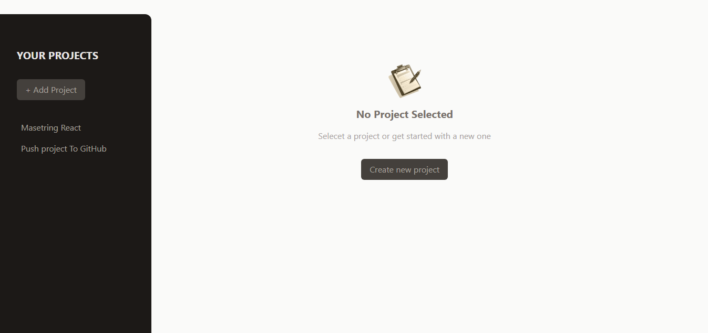
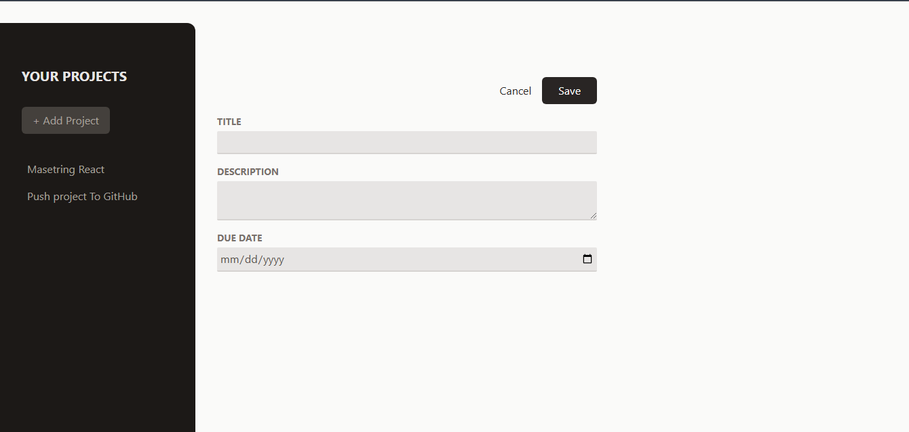
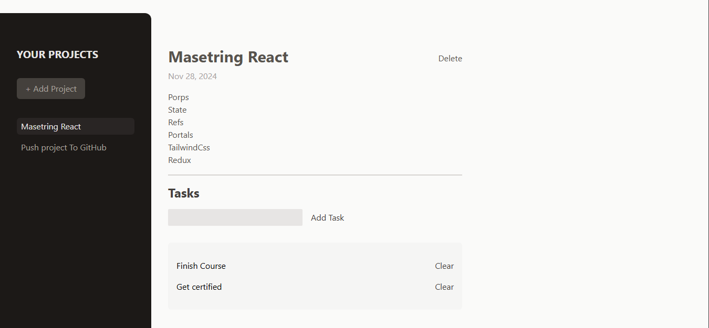

# React Project Manager

A modern task management application built with React. This app allows users to organize projects, assign tasks, and keep track of their progress with an intuitive and responsive interface.

[](https://react.dev/)

[](https://tailwindcss.com/)

## Project Overview

### No Selected Project Overview



### Add Project overview



### Project overview



## Features

1. Project Management

- Add new projects with titles, descriptions, and due dates.
- Select projects to view details and associated tasks.
- Delete projects when no longer needed.

2. Task Management

- Add tasks to specific projects.
- View, manage, and delete tasks.

3. Dynamic UI

- Responsive design for seamless usability.
- Conditional rendering ensures appropriate UI views for each state.

4. Error Handling

- Modal-based validation for empty fields when creating projects.

## Usage

1. Add a New Project

- Click the + Add Project button in the sidebar.
- Provide a title, description, and due date in the modal.
- Click Save to create the project.

2. Select a Project

- Click on any project in the sidebar to view its details and tasks.

3. Add Tasks

- Enter task details in the input field within the selected project view.
- Click Add Task to assign it to the project.

4. Manage Tasks and Projects

- Delete individual tasks by clicking Clear.
- Remove projects using the Delete button in the project view.

## File Structure

```
React-Art
│
│      .gitignore
│      .vite.config
│      index.html
│      package-lock.json
│      package.json
│      README.md
│      postcss.config.js
│      tailwind.config.js
│
└───public
│
│   add.svg
│   logo.png
│   overView.png
│   noSelection.png
│
└───src
    │   App.jsx
    │   main.jsx
    │   index.css
    │
    ├───assets
    │       no-projects.png
    │
    ├───components
    │    │   NewProject.jsx
    │    │   Button.jsx
    │    │   Modal.jsx
    │    │   Input.jsx
    │    │   NoProject.jsx
    │    │   ProjectSidebar.jsx
    │    │   SelectedProject
    │    │
    │    └─── Tasks
    │          NewTask.jsx
    │          Tasks.jsx
    │
```

## Installation

To get started with the project locally:

1. Clone the repository:
   ```bash
   git clone https://github.com/SalahShallapy/React-Project-Manager.git
   ```
2. Navigate to the project directory:
   ```bash
   cd React-Project-Manager
   ```
3. Install dependencies:
   ```bash
   npm install
   ```
4. Run the project:
   ```bash
   npm run dev
   ```

## Contributing

Contributions are what make the open source community such an amazing place to learn, inspire, and create. Any contributions you make are **greatly appreciated**.

If you have a suggestion that would make this better, please fork the repo and create a pull request. You can also simply open an issue with the tag "enhancement".
Don't forget to give the project a star! Thanks!

1. Fork the Project
2. Create your Feature Branch (`git checkout -b feature/AmazingFeature`)
3. Commit your Changes (`git commit -m 'Add some AmazingFeature'`)
4. Push to the Branch (`git push origin feature/AmazingFeature`)
5. Open a Pull Request

<p align="right">(<a href="#top">back to top</a>)</p>
